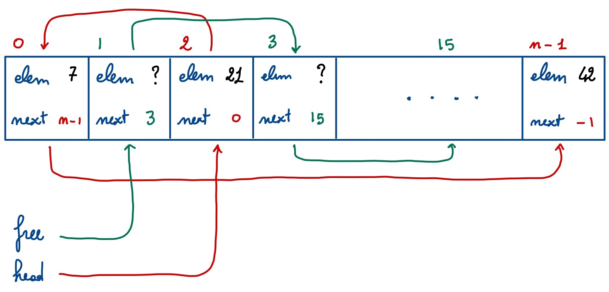

# Liste memorizzate in array

In questa esercitazione realizziamo quattro operazioni su liste
memorizzate in array. L'array contiene due liste, che chiamiamo
**lista usata** e **lista libera**. La lista usata memorizza le
informazioni che ci interessano effettivamente. La lista libera ci
serve esclusivamente per tenere organizzati i nodi che non sono
attualmente in uso ma che potremmo voler usare per aggiungere nodi
alla lista usata.



Innanzi tutto definiamo un tipo `Ptr` equivalente a `int` ma che
useremo per indicare l'indice (o "puntatore") di un nodo nell'array.

```c++
typedef int Ptr;
```

Questa direttiva serve esclusivamente per dare un nome alternativo
(in questo caso `Ptr`) a un tipo già esistente (in questo caso
`int`). Di fatto `Ptr` e `int` sono equivalenti, ma l'uso di `Ptr`
migliora la leggibilità del codice indicando più esplicitamente cosa
intendiamo rappresentare con una variabile o un argomento di quel
tipo.

Definiamo poi la struttura `Node` che rappresenta un singolo nodo
della lista.  Si noti l'uso di `int` come tipo dell'elemento e l'uso
di `Ptr` come tipo dell'indicatore al prossimo nodo. Usiamo il
numero `-1` come "indicatore non valido".

```c++
struct Node {
  int elem; // elemento del nodo
  Ptr next; // indice del prossimo nodo, -1 se questo è l'ultimo nodo
};
```

Infine, accorpiamo tutte le informazioni della lista in una struttura `List`
(come abbiamo già fatto nel caso delle pile e delle code). Una lista sarà
composta da un array di nodi (di dimensione `MAX`, costante da definire) e da
due indicatori, chiamati `head` e `free`, che ci dicono dove iniziano la lista
usata e la lista libera, rispettivamente.

```c++
struct List {
  Node node[MAX]; // tutti i nodi della lista
  Ptr head;       // inizio della lista usata
  Ptr free;       // inizio della lista libera
};
```

## Inizializzazione di una lista

Quando si crea una nuova struttura di tipo `List`, questa deve essere
inizializzata in modo tale che la lista usata sia vuota e che la lista libera
contenga tutti i nodi disponibili.

```c++
void init(List& l) {
  l.head = -1;                  // la lista usata è vuota
  l.free = 0;                   // la lista libera inizia all'indice 0
  for (int i = 0; i < MAX - 1; i++)
    l.node[i].next = i + 1;
  l.node[MAX - 1].next = -1;    // l'ultimo nodo della lista libera non ha prossimo
}
```

## Allocazione di un nodo

```c++
Ptr alloc(List& l, int elem, Ptr next) {
  const Ptr p = l.free;
  if (p == -1) {           // la lista libera è vuota, non c'è spazio!
    std::cerr << "out of memory" << std::endl;
    return -1;
  }
  l.free = l.node[p].next; // aggiorna l'inizio della lista libera
  l.node[p].elem = elem;   // inizializza elemento
  l.node[p].next = next;   // inizializza indice del prossimo nodo
  return p;
}
```

Questa funzione rimuove il primo nodo dalla lista libera e lo
inizializza in modo tale che l'elemento sia `elem` e l'indice del
nodo successivo sia `next`.  La funzione restituisce l'indice del
nodo allocato, oppure `-1` se la lista libera era vuota.

## Cancellazione di un nodo

```c++
void free(List& l, Ptr p) {
  if (p != -1) {
    l.node[p].next = l.free;
    l.free = p;
  }
}
```

Questa funzione inserisce il nodo con indice `p` nella lista libera,
rendendolo disponibile per successive allocazioni. Siccome l'ordine
dei nodi nella lista libera non è importante, il nodo liberato viene
inserito all'inizio della lista libera, che è un'operazione
efficiente in quanto non dipende dalla lunghezza della lista libera.

## Aggiunta di un elemento all'inizio

```c++
void push_front(List& l, int elem) {
  const Ptr p = alloc(l, elem, l.head);
  if (p != -1) l.head = p;
}
```

L'inserimento di un elemento all'inizio della lista (usata) richiede
l'allocazione di un nuovo nodo. Se l'allocazione ha successo, si aggiorna
l'indicatore del primo nodo della lista in modo che coincida con quello del nodo
appena allocato.

## Rimozione del primo elemento

```c++
void pop_front(List& l) {
  if (l.head != -1) {
    const Ptr p = l.head;         // ricordiamo il nodo da liberare
    l.head = l.node[l.head].next; // eliminiamo il primo nodo dalla lista usata
    free(l, p);                   // liberiamo il nodo
  }
}
```

La rimozione del primo elemento della lista (usata) consiste nell'aggiornare il
campo `head` e nel liberare il (vecchio) nodo iniziale della lista usata.
Occorre fare attenzione a ricordare in una variabile temporanea (`p`)
l'indicatore di tale nodo *prima* di aggiornare il campo `l.head`.

## Aggiunta di un elemento alla fine

```c++
void push_back(List& l, int elem) {
  Ptr p = l.head;
  while (p != -1 && l.node[p].next != -1)
    p = l.node[p].next;
  if (p == -1)
    // la lista è vuota, l'inserimento è in testa
    push_front(l, elem);
  else {
    // la lista non è vuota e p è l'indice dell'ultimo elemento
    const Ptr q = alloc(l, elem, -1);
    if (q != -1) l.node[p].next = q;
  }
}
```

L'aggiunta di un elemento in fondo alla lista usata presuppone di conoscere
l'indicatore del suo ultimo nodo. Infatti, il campo `next` di tale nodo dovrà
essere aggiornato per indicare il nodo allocato per il nuovo elemento. La prima
parte della funzione `push_back` si occupa di individuare l'indicatore
dell'ultimo nodo della lista usata, effettuando una scansione di tutta la lista
fino a trovare un nodo il cui campo `next` sia `-1`. Terminato il ciclo `while`
ci sono due sotto-casi da considerare:

* Se `p` è `-1` allora la lista usata era vuota fin da principio. In tal caso
  l'aggiunta di un elemento alla fine della lista coincide con l'aggiunta dello
  stesso elemento all'inizio, per cui tanto vale usare la funzione `push_front`
  già scritta con questo scopo senza replicarne il codice anche qui.
* Se `p` non è `-1`, allora è l'indicatore dell'ultimo nodo della lista usata.
  In tal caso allochiamo un nuovo nodo per l'elemento da aggiungere e
  aggiorniamo il campo `next` dell'ultimo nodo della lista (sempre che
  l'allocazione sia andata a buon fine).

## Rimozione dell'ultimo elemento

```c++
void pop_back(List& l) {
  Ptr prev = -1;
  Ptr p = l.head;
  // cerco l'ultimo nodo
  while (p != -1 && l.node[p].next != -1) {
    prev = p;
    p = l.node[p].next;
  }
  if (p != -1) { // c'era un nodo da rimuovere
    if (prev != -1) l.node[prev].next = -1;
    else l.head = -1;
    free(l, p);
  }
}
```

La rimozione dell'ultimo elemento della lista usata presuppone di conoscere
l'indicatore del **penultimo** nodo della lista. Infatti, sarà il campo `next`
di questo nodo a dover essere aggiornato per realizzare la rimozione dell'ultimo
elemento. Pertanto, la funzione individua innanzi tutto gli indicatori
dell'ultimo e del penultimo nodo della lista tenendo traccia dei loro indicatori
in due variabili ausiliarie `p` e `prev`. L'idea è che l'indicatore `prev`
"insegue" l'indicatore `p` man mano che questo avanza lungo la lista. All'inizio
`p` è l'indicatore del primo nodo della lista e `prev` è inzializzato a `-1`
(non c'è alcun nodo prima del primo nodo della lista). Fintantoché `p` è un
indicatore valido ed il nodo indicato ha un successore, `prev` e `p` vengono
fatti avanzare. Dunque il ciclo `while` termina se `p` diventa `-1` (cosa che
può accadere solo se la lista iniziale era vuota) oppure se `p` indica un nodo
senza successore, ovvero l'ultimo nodo della lista. Nel secondo caso si
distinguono due sotto-casi a seconda di cosa contiene `prev`. Se `prev` è un
indicatore valido, allora indica il penultimo nodo della lista nel quale il
campo `next` viene impostato a `-1`. Se `prev` non è valido, allora l'elemento
da rimuovere è effettivamente l'unico presente nella lista e allora si aggiorna
il campo `l.head` per indicare che la lista diventa vuota. In entrambi i
sotto-casi il nodo rimosso viene reinserito nella lista libera.

## Inversione di una lista

```c++
void reverse(List& l) {
  Ptr r = -1;     // indicatore del primo nodo della lista invertita
  Ptr p = l.head; // indicatore del primo nodo della lista da invertire
  while (p != -1) {
    const Ptr q = l.node[p].next;
    l.node[p].next = r;
    r = p;
    p = q;
  }
  l.head = r;
}
```

L'inversione di una lista (che inizia da `l.head`) si effettua per mezzo di un
indicatore ausiliario `r` che indica il primo nodo della lista invertita.
All'inizio la lista da invertire inizia da `l.head` e la lista invertita è
vuota, dunque `r` viene inizializzato a `-1`. Se la lista da invertire contiene
almeno un (indicato da `p`), si aggiorna il campo `next` di tale nodo in modo
che indichi `r` (l'inizio della vecchia lista invertita). Il vecchio valore di
tale campo viene parcheggiato in una variabile temporanea `q`, poi usata per
aggiornare `p`.

## Esercizi

1. Scrivere la funzione `int length(const List& l)` che calcola la
   lunghezza della lista (usata) `l`.
2. Scrivere la funzione `int sum(const List& l)` che calcola la
   somma degli elementi della lista `l`.
3. Scrivere la funzione `int find_min(const List& l)` che individua
   l'elemento più piccolo della lista `l`. Se la lista `l` non
   contiene elementi, la funzione deve restituire `-1`.
4. Scrivere (con una sola riga di codice, dopo aver risolto gli
   esercizi precedenti) la funzione `float average(const List& l)`
   che calcola la media degli elementi della lista `l`.
5. Scrivere la funzione `bool member(const List& l, int elem)` che
   determina se l'elemento `elem` appartiene o no alla lista `l`. La
   funzione deve rispondere `true` o `false` a seconda dei casi.
6. (**IMPEGNATIVO**) Scrivere la funzione `void insert(List& l, int
   elem)` che inserisce l'elemento `elem` in una lista `l` che si
   suppone essere **ordinata** in modo non decrescente. Il risultato
   deve essere una lista ordinata.
7. Dopo aver risolto l'esercizio precedente, scrivere una funzione `void
   sort(const List& l, List& m)` che ordina gli elementi della lista `l` e li
   memorizza nella lista `m`.
8. (**IMPEGNATIVO**) Scrivere la funzione `void remove(List& l, int elem)` che
   elimina **la prima occorrenza** dell'elemento `elem` dalla lista `l`. La
   lista non viene modificata se l'elemento `elem` non è presente.
