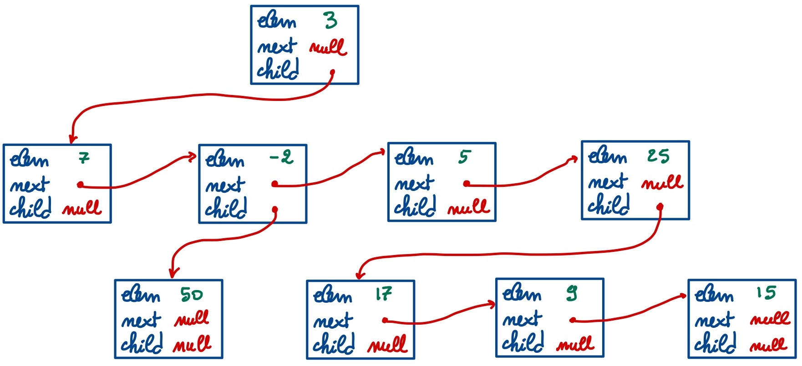

# Funzioni ricorsive su strutture dinamiche

## Esercizio 1

Data la seguente struttura per rappresentare nodi di liste dinamiche

``` c++
struct Node {
	int   elem;
	Node* next;
};
```

scrivere le seguenti funzioni ricorsive:

1. `int min_list(const Node* p)` per calcolare l'elemento più
   piccolo di una lista non vuota. Se la lista è vuota, la funzione
   deve stampare un messaggio di errore e restituire `-1`;
2. `int max_list(const Node* p)` per calcolare l'elemento più grande
   di una lista non vuota. Gestire il caso della lista vuota come
   nell'esercizio precedente;
3. `bool sorted(const Node* p)` per determinare se una lista è
   ordinata in modo non decrescente.

## Esercizio 2

Data la seguente struttura per rappresentare nodi di alberi binari

``` c++
struct Node {
	int   elem;
	Node* left;
	Node* right;
};
```

scrivere le seguenti funzioni ricorsive:

1. `int leaves(const Node* p)` per calcolare il numero di **foglie**
   di un albero binario, dove una foglia è un nodo senza figli;
2. **(IMPEGNATIVO)** `bool sorted(const Node* p)` per determinare se
   un albero binario è **ordinato**. Un albero binario è ordinato se
   l'elemento contenuto in ogni nodo è maggiore o uguale degli
   elementi nel figlio sinistro e minore degli elementi nel figlio
   destro. **Suggerimento**: definire due funzioni ausiliarie
   (ricorsive) per determinare se un numero è rispettivamente
   maggiore o uguale e minore di tutti gli elementi di un albero
   binario. **Nota**: la funzione non deve essere particolarmente
   efficiente e può fare visite multiple sull'albero.

\clearpage

## Esercizio 3

Sia data la seguente struttura per rappresentare alberi
generalizzati, in cui un nodo può avere un numero arbitrario di
figli:

``` c++
struct Node {
	int   elem;
	Node* next;  // puntatore al prossimo fratello
	Node* child; // puntatore al primo figlio
};
```

Si noti come questa struttura `Node` sia isomorfa a quella usata per
rappresentare **alberi binari**, ma l'interpretazione dei campi
cambia in maniera significativa. Ad esempio, per mezzo di questa
struttura è possibile rappresentare l'albero seguente:



* il nodo (con elemento) `3` ha quattro figli (con elementi) `7`,
  `-2`, `5` e `25`;
* il nodo `-2` ha un solo figlio `50`;
* il nodo `25` ha tre figli `17`, `9` e `15`;
* i nodi `7`, `5`, `50`, `17`, `9`, `15` non hanno figli.

Realizzare le seguenti funzioni:

1. `int depth(const Node* p)` per calcolare la profondità di un
   albero generalizzato. Si ricorda che la profondità di un albero è
   il numero massimo di nodi lungo un percorso dalla radice a
   `nullptr`, senza contare i passi necessari per passare da un nodo
   ai fratelli successivi;
2. `int sum(const Node* p)` per calcolare la **somma** di tutti gli
   elementi di albero generalizzato;
3. `void post(const Node* p)` per stampare tutti gli elementi di un
   albero generalizzato in "postorder" (cioè un elemento viene
   stampato **dopo** i suoi figli e **prima** dei fratelli
   successivi);
3. **(IMPEGNATIVO)** `int order(const Node* p)` per calcolare
   l'**ordine** di un albero generalizzato, ovvero il numero massimo
   di figli che ha un qualsiasi nodo dell'albero.
